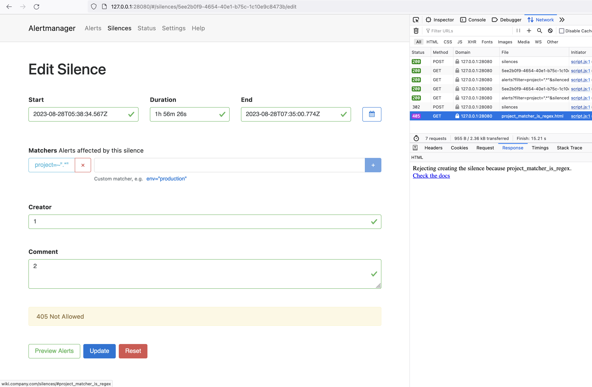

# alertmanager-openresty-filter

This is small example of how HTTP-requests can be filtered using openresty+lua.

## Global alertmanager for multiple project teams

### Problem

All the project teams has the same alertmanager. This happened to be very convinient for monitoring team to collect and route all the alerts from different Prometheuses in one HA cluster of Alertmanagers.

Theese Alertmanagers has no authorization proxies or even basic auth. Monitoring team wasn't concerned much about it for security reasons, but they wanted to minimize consequences in case of human error.

They wanted to make custom rules about "which silences could be created and how **wide** can they be".

### Solution

Okay, what are those silences anyway?  
Lets have a look at [OpenAPI spec for Alertmanager](https://github.com/prometheus/alertmanager/blob/v0.25.0/api/v2/openapi.yaml).  
Talking about silence that is too wide(affecting to much hosts and even several projects) thats one API method we are interested in:
```yaml
#...
basePath: "/api/v2/"
paths:
#...
  /silences:
    post:
      tags:
        - silence
      operationId: postSilences
      description: Post a new silence or update an existing one
      parameters:
        - in: body
          name: silence
          description: The silence to create
          required: true
          schema:
            $ref: '#/definitions/postableSilence'
      responses:
        '200':
          description: Create / update silence response
          schema:
            type: object
            properties:
              silenceID:
                type: string
#...
definitions:
  silence:
    type: object
    properties:
      matchers:
        $ref: '#/definitions/matchers'
      startsAt:
        type: string
        format: date-time
      endsAt:
        type: string
        format: date-time
      createdBy:
        type: string
      comment:
        type: string
    required:
      - matchers
      - startsAt
      - endsAt
      - createdBy
      - comment
#...
  matchers:
    type: array
    items:
      $ref: '#/definitions/matcher'
    minItems: 1
  matcher:
    type: object
    properties:
      name:
        type: string
      value:
        type: string
      isRegex:
        type: boolean
      isEqual:
        type: boolean
        default: true
    required:
      - name
      - value
      - isRegex
```

Ok, that's all we need to start. We'll be validating field `matchers` for POST request `/api/v2/silences`.  
Let's go and query promxy that tooks into all the project Prometheuses:
```
> count(ALERTS) by (alertname, project)
  {alertname="ExporterDown",                            project="core"}
  {alertname="KubernetesPodNotHealthy",                 project="banana-chat"}
  {alertname="KubernetesDeploymentReplicasMismatch",    project="choco-cash"}
  {alertname="OutOfMemory",                             project="peach-club"}
  {alertname="SystemdServiceCrashed",                   project="security"}
```

Looks like we have 6 projects, and all alerts coming from project Prometheus has corresponding label `project`.

Ok, so for now we define our checks for creating alerts that way:
* one `project` label should be set
* `project` label cannot be regexp
* `project` label cannot be inversed match

Let's try to implement them in simpliest lua filter:
```lua
if data then
    local data_json = cjson.decode(data)
    if data_json['matchers'] == nil then
        ngx.exit(ngx.HTTP_BAD_REQUEST)
    else
        for _,matcher in ipairs(data_json['matchers']) do
            if matcher['name'] == 'project' then
                table.insert(project_matchers, matcher)
            end
        end
    end
else
    ngx.exit(ngx.HTTP_BAD_REQUEST)
end

if #project_matchers == 0 then
    return_error('no_project_matcher')
end

if #project_matchers > 1 then
    return_error('several_project_matchers')
end

project_matcher = project_matchers[1]

if project_matcher['isRegex'] then
    return_error('project_matcher_is_regex')
end

-- This is an optional field
if project_matcher['isEqual'] ~= nil then
    if project_matcher['isEqual'] == false then
        return_error('project_matcher_is_inversed')
    end
end

ngx.exit(ngx.OK)
```

Check the full script `verify_silence.lua` and config `nginx.conf` for more details.


Lets start testing:
```
$ http --follow POST 127.0.0.1:28080/api/v2/silences < test_requests/data_correct.json
HTTP/1.1 200 OK


{
    "silenceID": "ae323a41-ae61-4a82-8429-9796597dcb1c"
}
```

What about "bad" silences? 
```
$ http --follow POST 127.0.0.1:28080/api/v2/silences < test_requests/data_bad_inverse.json
HTTP/1.1 405 Not Allowed

Rejecting creating the silence because project_matcher_is_inversed.<br><a href="http://wiki.company.com/silences#project_matcher_is_inversed">Check the docs</a>

$ http --follow POST 127.0.0.1:28080/api/v2/silences < test_requests/data_bad_multiple.json
HTTP/1.1 405 Not Allowed

Rejecting creating the silence because several_project_matchers.<br><a href="http://wiki.company.com/silences#several_project_matchers">Check the docs</a>

$ http --follow POST 127.0.0.1:28080/api/v2/silences < test_requests/data_bad_regex.json
HTTP/1.1 405 Not Allowed

Rejecting creating the silence because project_matcher_is_regex.<br><a href="http://wiki.company.com/silences#project_matcher_is_regex">Check the docs</a>
```

Although Alertmanager web-interface follows redirects as well as `http --follow`, it doesn't show you the error body, so in order to read error decription and got to link you will need to hit F12 and check the response:  

